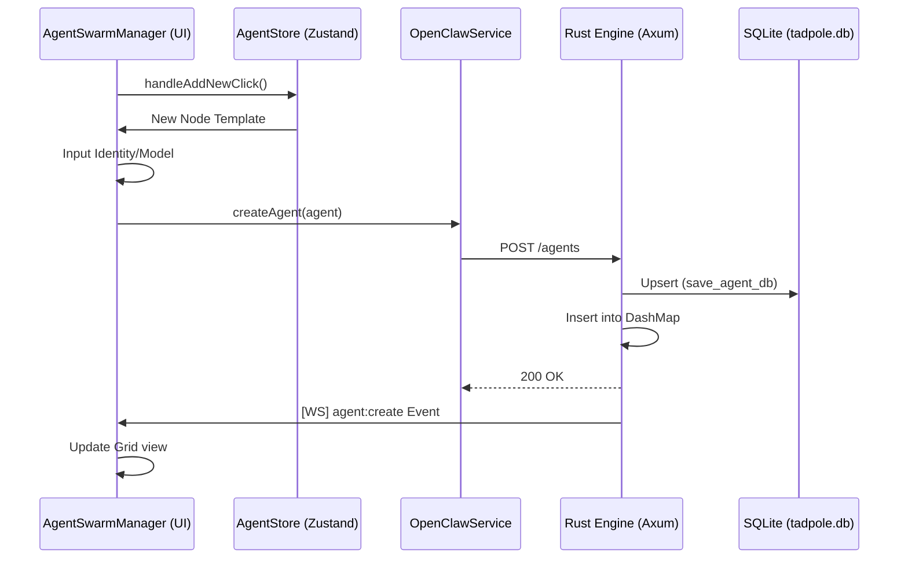

# 🧠 Tadpole Engine Architecture

## Overview

The Tadpole Engine is a local-first, multi-provider AI agent runtime designed for security, observability, and human oversight. It follows a **Gateway-Runner-Registry** pattern, implemented in **Rust** for high-performance async processing and memory safety.

## Core Components

### 1. Gateway Server (`server-rs/src/main.rs`)
The entry point for the backend, built using the **Axum** framework.
- **REST API**: Handles high-performance routing for agent tasks, health checks, and deployment triggers.
- **WebSocket Hub (`routes/ws.rs`)**: Multiplexes system logs and engine events over a single connection using `tokio::select!`.
- **CORS & Security**: Configurable middleware for safe browser communication.
- **Protocol-Aware Resolution**: Automatically detects `http` vs `https` environments (e.g., Tailscale) to prevent mixed-content blocks.

### 2. Agent Registry (`server-rs/src/agent/registry.rs`)
The "source of truth" for the agent swarm.
- **Static Registry**: Defines 26+ pre-configured agents with specific roles (CEO, CTO, etc.), departments, and model preferences.
- **Metadata Support**: Flexible metadata structures allow the frontend to render premium designs, including hierarchical **Resource Monitoring** (real-time cost/token tracking) and **Scrollable Mission Badges** for complex objective descriptions.

### 3. Agent Runner (`server-rs/src/agent/runner.rs`)
The "brain" of an individual agent execution loop. Refactored from a monolithic 770-line `run()` method into **15+ focused helper methods** with a `RunContext` struct for clean data flow.
- **Tokio-Native**: Spawns asynchronous tasks for every mission to ensure non-blocking operation.
- **Neural Handoff (SEC-04)**: Implements "Strategic Intent Injection." When spawning a sub-agent, the parent agent's current strategic thoughts are injected into the sub-agent's prompt, providing immediate alignment without redundant context cycles.
- **Swarm Governance**: Enforces a recursive depth limit of **5** and implements **Lineage Awareness** (using `swarm_lineage`) to detect and block circular recruitment loops (e.g., A -> B -> A).
- **Parallel Swarming (PERF-06)**: Uses `FuturesUnordered` to execute multiple tool calls in parallel. This enables an agent to recruit an entire department simultaneously, reducing swarm latency by up to 80%.
- **Inheritance Logic**: Sub-agents automatically inherit the parent's model configuration and provider credentials.
- **Provider Adapters (`agent/gemini.rs`, `agent/groq.rs`)**: Accept a shared `reqwest::Client` from `AppState` — connection pool is reused across all LLM calls for zero TLS handshake overhead between requests.
  - **Self-Healing Retry**: Automatically recovers from `tool_use_failed` Groq syntax errors via a corrective multi-turn retry.
- **Rate Limiting (`agent/rate_limiter.rs`)**: `RateLimiter` enforces RPM (via `tokio::sync::Semaphore`) and TPM (via `AtomicU32` + window reset) limits. Configured per-model via `ModelConfig.rpm` / `ModelConfig.tpm`. No-op when limits are not configured.
- **Telemetry**: Real-time broadcast of thinking/idle states and token usage to the global EventBus.
- **Budget Enforcement**: Real-time monitoring of USD burn rate with "Emergency Pause" protocol integration.
- **Type-Unified `ModelConfig`**: 12-field struct aligned 1:1 between TypeScript and Rust. Serde renames ensure camelCase compatibility across the WebSocket boundary.
- **Dynamic Skills Execution**: Detects when a function call matches a dynamically loaded skill and securely spawns the script as a subprocess via `std::process::Command`, returning output directly into the reasoning loop.

### 4. Financial Control & Registry (`server-rs/src/agent/rates.rs`)
The fiscal governance layer of the engine.
- **Neural Cost Registry**: A centralized registry of USD rates per 1k tokens for all supported models.
- **Real-time Cost Engine**: Calculates the monetary impact of every agent turn based on actual token usage.
- **Budget Propagation**: Missions carry financial payloads from the frontend to the engine for cluster-level control.

### 4b. Capabilities Registry (`server-rs/src/agent/capabilities.rs`)
The dynamic knowledge and skills layer.
- **File-System Registry**: Persists Skills (JSON schema + execution command) and Workflows (Markdown guidelines) natively in the `data/skills` and `data/workflows` directories.
- **Dual Execution Modes**: 
  - **Dynamic Skills**: The engine securely spawns the execution command (e.g., Python/Bash script) as a subprocess.
  - **Native Skills**: For core engine functionalities (like sandboxed file I/O or `archive_to_vault`), the execution command is marked `(Native Execution Mode)` and the logic is handled directly within the Rust `AgentRunner` for maximum security and performance.
- **In-Memory Caching**: Loads capabilities into a memory cache upon server start and API modifications, ensuring zero disk I/O bottlenecks during the hot agent execution loop.
- **Advanced Metadata**: Includes `id`, `doc_url`, and `tags` for enhanced UI grouping and automated documentation cross-referencing.
- **Dynamic Injection**: Intercepts the `build_tools()` phase to dynamically merge registry capabilities into the agent's context.

### 5. Oversight Gate (`server-rs/src/main.rs` & `agent/runner.rs`)
The human-in-the-loop security layer.
- **Async Interruption**: Uses `tokio::sync::oneshot` channels to pause agent execution during sensitive tool calls.
- **Approval Queue**: Managed via `DashMap` for thread-safe, concurrent access to pending decisions.
- **Protected Operations**: `archive_to_vault`, `notify_discord`, `complete_mission`, and `delete_file` all require explicit human approval before execution.

### 6. FilesystemAdapter (`server-rs/src/adapter/filesystem.rs`)
The sandboxed workspace I/O layer.
- **Workspace Anchoring**: Each agent's `RunContext` contains a `workspace_root: PathBuf` derived from the mission's `cluster_id`. All file operations are strictly confined to this directory.
- **Symlink-Safe Canonicalization (SEC-03)**: Both the workspace root and candidate file paths are resolved via `std::fs::canonicalize` before comparison — defeating symlink-based sandox escape attempts.
- **Operations**: `read_file`, `write_file`, `list_files` (sorted), `delete_file` (oversight-gated).

### 7. Rate Limiter (`server-rs/src/agent/rate_limiter.rs`)
Enforces LLM provider API quotas at the engine level.
- **RPM**: Sliding 60-second window via `tokio::sync::Semaphore`. Permits are acquired before each API call and automatically released after 60 seconds.
- **TPM**: Rolling token counter via `AtomicU32`. Window resets every 60 seconds. Requests that would exceed the quota are delayed (not dropped) until the window resets.
- **Opt-In**: No-op when `rpm`/`tpm` are `None` on the model. Configure via the Model Manager UI.

### 8. Dynamic Role System (`src/services/roleStore.ts`)
The organizational "Blueprint" layer.
- **Neural Role Store**: A reactive Zustand-based store that persists custom agent roles.
- **Configuration-to-Role Promotion**: Allows manual agent configurations (skills/workflows) to be "promoted" to system-level roles, enabling rapid swarm templating.
- **Referential Stability**: Implements `React.memo` with custom comparison logic for `HierarchyNode` to ensure agent-level state updates only trigger local re-renders.

### 9. Agent Sovereignty & Neural Handoff (`routes/audio.rs` & `agent/runner.rs`)
The "Top Tier" voice-command intelligence layer.
- **Neural Transcription (Groq Whisper)**: High-fidelity audio capture via the frontend is routed through `/engine/transcribe` to **Whisper-large-v3** on Groq.
- **Strategic-to-Tactical Bridge**: To achieve "Top Tier" status, **Tadpole OS** implements a multi-layer delegation model where a sovereign orchestrator (ID 1) directs autonomous tactical nodes.
- **Autonomous Delegation**: Creates a seamless "Neural Handoff" — user speaks to the Strategic Director, who manages the execution swarm.

### 10. Persistence Layer (`server-rs/src/agent/persistence.rs`)
The "State-to-Disk" synchronization engine.
- **SQLite Backend (`tadpole.db`)**: Uses **sqlx** for asynchronous persistence of agents, missions, and logs.
- **Concurrent Saves**: `AppState.save_agents()` uses `futures::join_all()` to persist all agents in parallel — O(1) wall-clock time regardless of agent count.
- **Absolute Path Resolution**: Enforces absolute paths for `DATABASE_URL` to ensure environment stability on Windows.
- **JSON Fallback**: Opt-in via `LEGACY_JSON_BACKUP=true` env var.

### 11. Reliability Layer (Hardening)
Architected for heavy MISSION-CRITICAL stability.
- **Atomic Registry Sync**: Registry reloads (Skills/Workflows) use a "Load-then-Swap" strategy in `capabilities.rs`. Disk I/O occurs on a background buffer, and the active `DashMap` is only hot-swapped after successful validation, ensuring zero "Registry Empty" race conditions.
- **Process Guard (Execution Timeouts)**: Every dynamic skill subprocess is wrapped in an asynchronous timeout (default 60s) in `runner.rs`. This prevents orphan processes or engine stalls caused by malfunctioning scripts.
- **Problem Details (RFC 9457)**: A dedicated `ProblemDetails` utility in `routes/error.rs` ensures that every engine failure is broadcast as a machine-readable specification, aligning with high-end cloud standards.
- **Lifecycle Hooks**: Implements `pre-tool` and `post-tool` hooks. These are executable scripts located in `server-rs/data/hooks` that are automatically triggered before/after any tool execution for automated security auditing and result analysis.
- **OS Identity & Memory**: Injects `IDENTITY.md` and `LONG_TERM_MEMORY.md` into every agent's system prompt. This provides a persistent "Core Directive" and cross-session learning capability, ensuring the swarm adheres to the bunker's architectural standards.

## Data Flow

1.  **Dashboard** sends a task to `POST /agents/:id/send`.
2.  **Axum** routes the request and fetches the agent configuration from the **Registry**.
3.  **AgentRunner** spawns a background mission, resolves the `workspace_root`, and acquires a rate-limit permit.
4.  **Provider** is called via the **shared `reqwest::Client`** (connection pool reused).
5.  **Oversight Gate** intercepts tool calls (if required), broadcasting `oversight:new` via WebSockets.
6.  **User** clicks "Approve/Reject" on the dashboard, hitting `POST /oversight/:id/decide`.
7.  **Gate** resolves the oneshot channel, allowing the **Runner** to proceed or abort.
8.  **Telemetry** streams all events back to the dashboard log in real-time.

### Agent Lifecycle & Registration



## Performance Architecture

| Optimization | Where | Detail |
|---|---|---|
| Shared `reqwest::Client` | `AppState` | Single TCP connection pool, `pool_max_idle_per_host=20`. No TLS handshake per call. |
| Concurrent Agent Saves | `state.rs` | `join_all()` — all DB writes run in parallel, O(1) wall time |
| Zero-alloc Lineage Check | `runner.rs` | `iter().any()` instead of `to_string()` allocation |
| RPM/TPM Rate Limiter | `rate_limiter.rs` | `Semaphore`-based window; blocks task, not thread |
| Parallel Swarming | `runner.rs` | `FuturesUnordered` loop for concurrent tool execution |
| Shared HTTP Client | `state.rs` | Connection reuse across all providers |
| Broadcast Channel | `state.rs` | `tokio::sync::broadcast` avoids per-subscriber copies |

### Frontend
- **Terminal RAF Batching**: `Terminal.tsx` buffers EventBus events and flushes on `requestAnimationFrame`, reducing re-renders.
- **Circular EventBus**: `eventBus.ts` uses a true circular buffer (fixed 1000-slot ring) with O(1) writes.
- **O(1) Agent Resolution**: `commandProcessor.ts` builds Map indexes at function entry.
- **Vendor Chunk Splitting**: `vite.config.ts` separates `react`, `lucide-react`, and `zustand` into dedicated vendor bundles.

## Directory Structure

```
tadpole-os/
├── server-rs/          # Rust Backend (Axum + Tokio)
│   ├── src/
│   │   ├── agent/
│   │   │   ├── runner.rs        # Core execution loop + tool dispatch
│   │   │   ├── gemini.rs        # Google Gemini provider (shared client)
│   │   │   ├── groq.rs          # Groq provider (shared client)
│   │   │   ├── rate_limiter.rs  # RPM/TPM enforcement ← NEW
│   │   │   ├── mission.rs       # Mission CRUD + DRY row helpers
│   │   │   ├── persistence.rs   # DB + JSON registry layer
│   │   │   ├── registry.rs      # Default agent definitions
│   │   │   ├── rates.rs         # USD/token cost calculator
│   │   │   ├── capabilities.rs  # Dynamic skills & workflows file registry
│   │   │   └── types.rs         # Shared type definitions
│   │   ├── adapter/
│   │   │   ├── filesystem.rs    # Sandboxed workspace I/O ← HARDENED
│   │   │   ├── vault.rs         # Markdown vault persistence
│   │   │   └── discord.rs       # Discord webhook notifications
│   │   ├── routes/              # HTTP and WebSocket handlers
│   │   └── state.rs             # AppState + shared HTTP client ← UPDATED
├── workspaces/         # Agent physical sandboxes (one dir per cluster)
├── src/                # Frontend (React/Vite)
├── Dockerfile          # Multi-stage production container
├── docker-compose.yml  # Volume mapping for workspaces + DB
└── deploy.ps1          # Automated deployment script
```

## Security Model

| Control | Mechanism |
|---|---|
| **Memory Safety** | Rust ownership — no buffer overflows, no data races |
| **Auth Token** | `NEURAL_TOKEN` — **panics at startup in release builds if not set** |
| **Sandbox Isolation** | `FilesystemAdapter` with `canonicalize`-based containment check |
| **Symlink Escape Prevention** | Both paths canonicalized before `starts_with` comparison |
| **Oversight Gate** | All destructive tool calls require oneshot approval |
| **Thread Isolation** | Each agent runner operates in an isolated Tokio task |
| **API Key Safety** | Keys injected per-request; never embedded in shared client headers |

---

## Workspace & Cluster Management

Tadpole OS distinguishes between **Logical Clusters** (UI-facing missions) and **Physical Workspaces** (Backend file sandboxes).

### 1. Logical Clusters (Mission Clusters)
- **Source of Truth**: The frontend `workspaceStore.ts` and the user's browser `localStorage`.
- **Persistence**: Stored in the browser's persistent state (`tadpole-workspaces-v3`).

### 2. Physical Workspaces (Sandboxes)
- **Source of Truth**: The `workspaces/` directory on the backend filesystem.
- **Mapping**: `cluster_id` is sanitized and appended to `./workspaces/` to create the agent's `workspace_root`.
- **Security**: The `FilesystemAdapter` uses `std::fs::canonicalize` to resolve all paths before allowing access.

---

## 🤖 Context for AI Assistants

1. **State Ownership**: The Rust engine is the primary source of truth for **agent configurations**. Mission Clusters are owned by the frontend in LocalStorage.
2. **Tool Protocol**: All agent tools must return an `anyhow::Result<String>`.
3. **Workspace Paths**: Never hardcode workspace paths. Always use `ctx.workspace_root` from `RunContext`.
4. **Lineage Safety**: Never remove the lineage check in `validate_input`. It is the core guard against token-burn loops.
5. **WebSocket Protocol**: System logs use a JSON-wrapped event bus. If a log isn't appearing, check the `BroadcastHandler` in `ws.rs`.
6. **CEO Sovereignty**: ID 1 (Agent of Nine) is the ONLY node that should use `issue_alpha_directive`.
7. **Rate Limiter**: Never bypass `RateLimiter.acquire()`. It is the only enforcement point for API quotas.
8. **HTTP Client**: Never create a `reqwest::Client` directly in handlers. Always use `state.http_client`.
