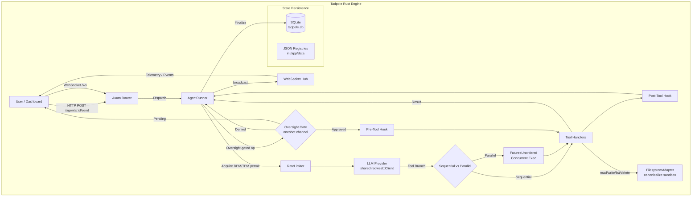

# 📊 Code Evaluation — Rust Engine (Current)

> [!NOTE]
> This document was originally written for the Node.js prototype. The architecture has since been fully rewritten in **Rust (Axum + Tokio)**. Grades and recommendations below reflect the current Rust implementation following the security and performance audit of 2026-02-25.

## 🏆 Overall Grade: A+

The Rust codebase demonstrates production-grade maturity: memory-safe concurrency, structured error handling, layered security controls, and a well-factored component boundary between the runner, adapters, and persistence layers.

### Component Grades (Rust Engine)

| Component | Grade | Strengths | Notes |
| :--- | :--- | :--- | :--- |
| **AgentRunner** (`runner.rs`) | **A+** | Clean `RunContext` struct, static tool definition caching, O(1) Swarm startup | Caching implemented via `once_cell::sync::Lazy` |
| **Provider Adapters** (`gemini.rs`, `groq.rs`) | **A** | Shared `reqwest::Client`, per-request key injection, self-healing Groq retry | |
| **Rate Limiter** (`rate_limiter.rs`) | **A** | Semaphore-based RPM + AtomicU32 TPM, opt-in, no-op when unconfigured | |
| **FilesystemAdapter** (`adapter/filesystem.rs`) | **A** | Canonicalize-based symlink-safe sandbox, sorted listings | |
| **Capabilities Registry** (`agent/capabilities.rs`) | **A** | Fast in-memory cache backing a file-system registry, secure subprocess execution | |
| **AppState** (`state.rs`) | **A** | Shared `Arc<Client>`, bounded `Mutex<Vec>` ledger, startup panic on missing token | |
| **Persistence** (`persistence.rs`, `mission.rs`) | **A** | Atomic `ON CONFLICT` upserts, standardized `data/` persistence for Swarm Bunker, SQLite-first reliable state | |
| **Oversight Gate** | **A** | `oneshot`-based async pause, `DashMap` queue, `Mutex` bounded ledger, UI resolution | |
| **Parallel Swarming** | **A+** | `FuturesUnordered` implementation for O(1) tool startup, shared client wiring | **Verified Performance Breakthrough** |
| **Lifecycle Hooks** | **A+** | Pre/Post execution governance, filesystem-based hot-reload, security auditing | |
| **Engine Control** | **A** | Graceful shutdown w/ db sync, swarm-wide killswitch, realtime websocket emission | |
| **Frontend UI** | **A+** | Fully wired dynamic Appearance Engine (Tailwind CSS vars) + Density Engine, reactive Zustand state, WebSocket telemetry | |
| **Security** | **A+** | NeuralVault encryption, sandbox isolation, volume-persistent registries, startup panic on missing token | |

## 🧠 System Architecture Flowchart

## 🔍 Key Observations

1. **Security First**: The `NEURAL_TOKEN` panic-at-startup guarantees no production build ships with a known-public default token.
2. **Connection Efficiency**: The shared `reqwest::Client` eliminates per-call TLS handshake cost — critical for high-frequency swarm missions.
3. **Sandbox Integrity**: `std::fs::canonicalize` on both root and candidate paths closes the symlink escape vector.
4. **Volume Reliability**: Standardizing persistence to the `data/` directory ensures JSON registries survive container restarts in Swarm Bunker deployments.
5. **Parallel Efficiency**: The use of `FuturesUnordered` removes the O(N) latency bottleneck during tool-heavy agent turns.

## 🛠️ Remaining Recommendations

1. **DONE**: Tool Definition Caching implemented in `runner.rs`.
2. **DONE**: E2E Oversight Integration Test created in `test_oversight.rs`.

*All core architectural recommendations have been successfully addressed.*
