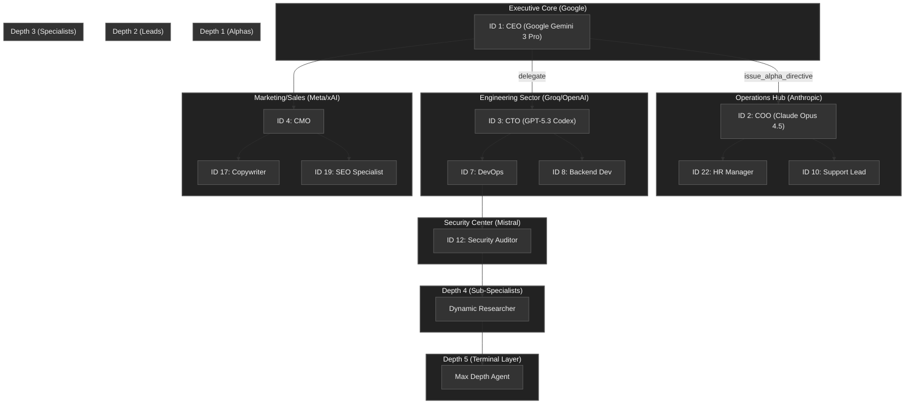

# 🐸 Tadpole OS Engine


A high-performance, local-first **Tadpole OS** runtime. This engine provides a sovereign, secure, and hyper-efficient environment for complex multi-agent swarms, powered by **Rust** for mission-critical stability and peak performance.

- **Tadpole OS Intelligence Layer:**
  - **Strategic Intent Handoffs:** Parent agents inject tactical context into sub-agent neural pathways.
  - **Parallel Swarming:** Concurrent multi-agent recruitment via `FuturesUnordered`.
  - **Lifecycle Hooks:** `pre-tool` and `post-tool` executable governance.
  - **Persistent Memory & Identity:** Global `IDENTITY.md` and `LONG_TERM_MEMORY.md` injection.
- **Unified Capability Model:** Enhanced metadata (`tags`, `doc_url`) for skills and workflows.
- **Command Palette:** Global `Cmd+K` / `/` navigation for agents and actions.
- **Neural Lineage Breadcrumbs:** Real-time visibility into the swarm's recursive hierarchy.
- **Standardized Observability:** Full RFC 9457 Problem Details compliance and cost telemetry.

## 🚀 Getting Started

### Prerequisites

- **Rust (1.80+):** Required for compiling the backend.
- **Node.js 20+:** Required for the React dashboard.
- **Google Gemini API Key:** For the primary reasoning loop.

### Installation

1.  **Install Frontend Dependencies:**
    ```bash
    npm install
    ```

2.  **Prepare Backend:**
    The backend is located in `server-rs/`. It will be compiled on the first run via the `npm` scripts.

3.  **Configure Environment:**
    Create a `.env` file in the root directory:
    ```env
    NEURAL_TOKEN=your_secret_token_here
    GOOGLE_API_KEY=your_api_key_here
    ```
    > **Production Required:** `NEURAL_TOKEN` must be set — the engine panics at startup in release builds if it is missing.

### Running the Engine

Start the high-performance Rust engine:

```bash
npm run engine
```

The engine will start on `http://localhost:8000`.

### Running the Dashboard

In a separate terminal, start the React development server:

```bash
npm run dev
```

## � Example of a Hyper-Swarm Scenario: Max Scale Visualization

Here is what a **Full-Capacity Swarm** looks like when utilizing all potential offerings (10 Providers, 25 Agents, 10 Clusters, Recursion Depth 5).

### Swarm Hierarchy (Sample Topology)



### Resource Allocation Matrix (Max Scale)

| Cluster | Focus | Provider (Sample) | Model Capacity |
| :--- | :--- | :--- | :--- |
| **Executive Core** | Strategic Direction | **Google** | Pro / Flash |
| **Operations Hub** | Orchestration | **Anthropic** | Opus / Sonnet |
| **Engineering Sector** | Implementation | **Groq / OpenAI** | Llama / Codex |
| **Marketing/Sales** | Growth | **Meta / xAI** | Maverick / Grok |
| **Security Center** | Auditing | **Mistral** | Medium / Large |
| **Product Lab** | R&D | **DeepSeek** | V3 / R1 |
| **Finance Sector** | Fiscal Control | **Perplexity** (API) | Sonar |
| **Human Capital** | HR/Logistics | **OpenSource** | Qwen / GLM |
| **Legal/Compliance** | Risk Mgmt | **Local** | Ollama/Llama3 |
| **Logistics** | Fleet Mgmt | **Azure** | GPT-4o |

### Operational Impact of "Max Scale"
- **Distributed Compute**: 10 clusters allow for complete physical or logical isolation of workloads, preventing mission interference.
- **Provider Redundancy**: If a primary provider (e.g., Google) hits a rate limit, the swarm can dynamically reassign agents to 9 other fallback providers.
- **Recursive Density**: With a depth of 5, a single strategic prompt can fan out into over **100 concurrent sub-tasks** if each layer recruits just 3-4 specialists.
- **Token Expenditure**: At this scale, real-time cost monitoring (USD budget gate) becomes critical, as the "Neural Pulse" generates massive event bus traffic.

## 🤖 Multi-Model Management (Triple-Slot Architecture)

Tadpole OS supports **Multi-Model Routing** for every agent, allowing for manual failover or task-specific specialized model selection.

1.  **Triple-Slot Configuration**: Every agent possesses three model slots (Primary, Secondary, Tertiary).
2.  **Granular Control**: Each slot can have its own provider (e.g., Gemini 1.5 Pro on Primary, Llama 3 on Secondary), system prompt, and temperature.
3.  **Manual Routing**: Using the "Zap" (Skill) icon on an agent node, operators can manually dispatch specific skills to specific slots.
4.  **Persistent Active Slot**: The frontend tracks the `activeModelSlot` (1, 2, or 3) to ensure the agent's "Neural Presence" reflects its current active intelligence.


## 📚 Documentation Excellence
Tadpole OS provides a comprehensive "Strategic Success" suite for both the Overlord (Entity 0) (AKA Human-in-the-loop) and AI assistants:

- **[System Architecture](ARCHITECTURE.md)**: Technical deep dive and data flows.
- **[Getting Started Guide](GETTING_STARTED.md)**: Hardware requirements and first deployment.
- **[Swarm Orchestration](SWARM_ORCHESTRATION.md)**: Guide to designing hierarchical, autonomous intelligence clusters.
- **[Conceptual Glossary](GLOSSARY.md)**: Standardized terminology for Human-AI alignment.
- **[AI Codebase Map](CODEBASE_MAP.md)**: Relationship guide optimized for AI development and navigation.
- [API Reference](API_REFERENCE.md): Complete REST and WebSocket endpoint documentation.
- [Contributing Standards](CONTRIBUTING.md): Guidelines for joining the swarm.

## 🔱 Sovereign Forking Protocol

Tadpole OS is built to be a foundational layer for your own AI endeavors. To create your own instance:

1. **Fork this Repository**: Click the 'Fork' button to create your own tacticial branch.
2. **Setup Local Environment**: Follow the [Getting Started Guide](GETTING_STARTED.md).
3. **Customize your Agents**: Modify `server-rs/src/agent/registry.rs` to define your own swarm specialists.
4. **Deploy**: Use the `deploy.ps1` script to push to your own Swarm Bunker.

We encourage "Overlords" to share their unique agent configurations and skill-sets back to the core via Pull Requests.

> [!TIP]
> **AI Readiness**: You can ask any AI assistant (like Claude or Gemini) to read the `CODEBASE_MAP.md` and `GLOSSARY.md` to get an instant, expert-level understanding of this project's inner workings.

---

- **Rust Engine (`server-rs/`):** The Axum-based server handling WebSockets, agent routing, and AI execution.
- **Agent Registry (`server-rs/src/agent/registry.rs`):** Static definitions for the 26-agent swarm.
- **Runner (`server-rs/src/agent/runner.rs`):** The native Tokio-based loop managing LLM communication.
- **Oversight Dash:** The Overlord (Entity 0) (AKA Human-in-the-loop) safety gate for approving/rejecting sensitive actions.

## 📜 License

MIT
