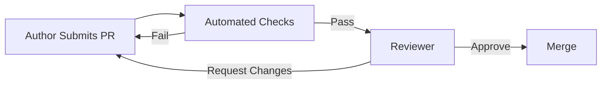

# Code Review Protocol

Code Review is the primary defense against technical debt and security vulnerabilities. It is not just about finding bugs, but about knowledge sharing and maintaining codebase health.

## Architecture

The review process is a dialogue, not a dictation:

### 1. Automated Checks (The Gatekeeper)
Linters, unit tests, and security scans must pass before a human looks at the code. Don't waste human time on machine-detectable errors.

### 2. Functional Review
Does the code do what it's supposed to do? Does it handle edge cases?

### 3. Structural Review
Is the code maintainable? Is it readable? Does it follow existing patterns?

### 4. Security Review
Are there SQL injections? XSS vulnerabilities? Exposed secrets? Insecure dependencies?

## When to Use
- **Every Pull Request**: No code enters `main` without review.
- **Design Review**: Reviewing plans before code is written.

## Operational Principles
1. **Be Kind**: Critique the code, not the author.
2. **Be Specific**: "Fix this" is bad. "This loop is O(n^2), consider using a hash map for O(n)" is good.
3. **Blockers vs. Nits**: Distinguish between "Must Fix" (bugs, security) and "Nice to Have" (style, preference).
