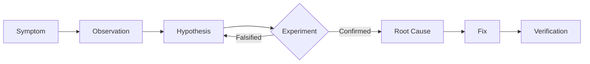

# Debugging Protocol

The Debugging Protocol is a rigorous method for isolating software defects, designed to move from symptom to root cause with mathematical certainty. It prevents "shotgun debugging" by enforcing hypothesis generation and falsification.

## Architecture

The workflow follows a scientific method approach:

### 1. Observation
Gather all available data points (logs, stack traces, user reports, reproduction steps). Do not attempt to guess the cause yet.

### 2. Hypothesis Generation
Based on observations, propose a falsifiable hypothesis (e.g., "The auth token is expiring because the refresh loop is blocked").

### 3. Experiment execution
Design a test specifically to prove or disprove the hypothesis. Isolate variables.

### 4. Verification
Once a fix is implemented, verify not only that the bug is gone, but that the fix *caused* it to be gone (revert and repro).

## When to Use
- **Production Incidents**: When time is critical but accuracy is paramount.
- **Flaky Tests**: Investigating non-deterministic failures.
- **Performance Regressions**: Isolating specific commits or calls causing slowdowns.

## Operational Principles
1. **Reproduce First**: Never attempt a fix without a reliable reproduction case.
2. **Change One Thing**: Isolate variables during experiments.
3. **Read the Error**: Do not skim. Read the exact error message and stack trace line by line.
