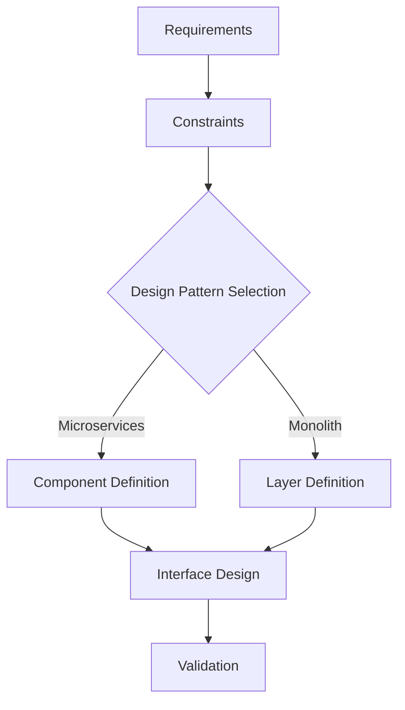

# System Architecture Protocol

This protocol guides the high-level design of software systems, ensuring they meet functional requirements while remaining robust against failure and adaptable to change.

## Architecture

The architectural design process follows a top-down approach:

### 1. Requirements & Constraints Analysis
Identify not just what the system must do (functional), but how it must behave (non-functional: latency, throughput, availability). Explicitly list constraints (budget, team size, time).

### 2. Pattern Selection
Choose the architectural pattern that best fits the constraints.
- **Microservices**: High scalability, high complexity.
- **Monolith**: Low complexity, easier deployment, harder to scale teams.
- **Event-Driven**: High decoupling, eventual consistency challenges.

### 3. Component/Layer Definition
Define the major blocks of the system. Responsibilities must be orthogonal (Separation of Concerns).

### 4. Interface Design (API)
Define how components talk to each other. This is the most critical part to get right early, as it is the hardest to change later.

### 5. Testing & Verification
All code must pass the **Tadpole Automated Test Suite** before merging.
- **Unit Tests**: Verify logic in isolation (e.g., Oversight Gate).
- **Integration Tests**: Verify subsystem interaction (e.g., FileSystem Skill).
- **Manual Verification**: Use the Browser Subagent for UI checks.

## When to Use
- **New Project Kickoff**: Establishing the foundation.
- **Major Refactor**: Breaking apart a monolith or rewriting a core module.
- **Scaling Challenges**: When the current architecture hits a bottleneck.

## Operational Principles
1. **Simple is Better**: Complexity is technical debt. Avoid "resume-driven development".
2. **Design for Failure**: Assume every component will fail. How does the system recover?
3. **Drafting is Cheap, Coding is Expensive**: Iterate on the whiteboard/document, not in the IDE.
4. **Trust, but Verify**: Agents are autonomous but not infallible. Oversight is mandatory.
