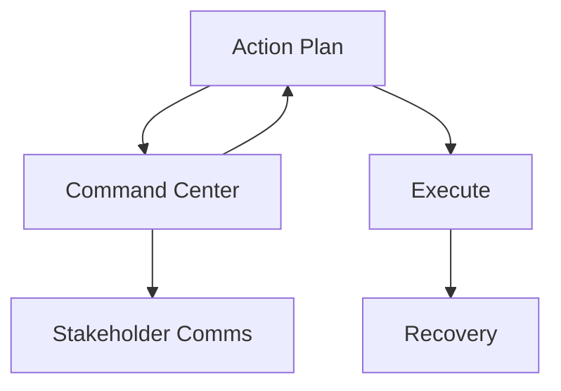

# Crisis Management Protocol

Leading the company through turbulent times without losing trust.

## Architecture

### 1. Command Center
Establish a single source of truth. NO leaks.
- Who is the spokesperson?

### 2. Stakeholder Comms
- **Employees**: Tell them first. Be as transparent as legally possible.
- **Customers**: Reassure them of service continuity.
- **Investors**: Give them the raw facts and the plan.

### 3. Action Plan
Focus on the immediate threat. Survive today to fight tomorrow.

## When to Use
- **PR Scandal**: Bad press.
- **Legal Suit**: Lawsuit filed.
- **Executive Departure**: Key leader quits unexpectedly.

## Operational Principles
1. **Speed Kills Rumors**: Get the narrative out fast.
2. **Own It**: Verify the mistake. Apologize. Fix it.
3. **Designate a devil's advocate**: Someone to challenge groupthink in the war room.
