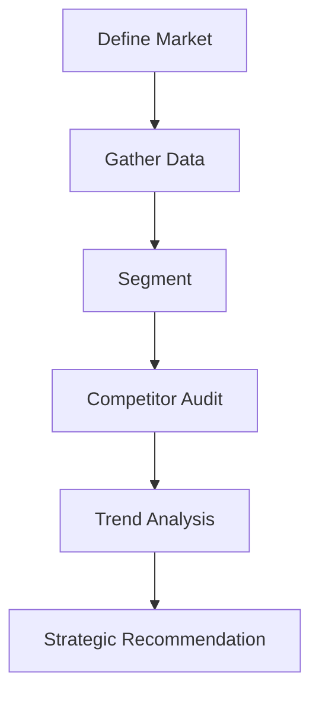

# Market Analysis Protocol

This protocol guides the gathering and synthesis of external market data to validate strategic direction.

## Architecture

### 1. Define Market (SAM/TAM)
- **Total Addressable Market (TAM)**: Everyone who *could* buy.
- **Serviceable Addressable Market (SAM)**: Who we can actually reach.
- **Serviceable Obtainable Market (SOM)**: Who we can get right now.

### 2. Competitor Audit
Identify Direct, Indirect, and Replacement competitors.
- *Tip*: Look at their pricing page and changelogs.

### 3. Trend Analysis (PESTLE)
- **Political, Economic, Social, Technological, Legal, Environmental**.
- Which of these headwinds/tailwinds are strongest?

## When to Use
- **New Product Line**: Before writing a line of code.
- **Pivot**: Decision to change direction.
- **Fundraising**: Pitch deck preparation.

## Operational Principles
1. **Facts over Feelings**: "I think AI is big" vs "AI investment grew 400% YoY".
2. **Look for the "Why Now"**: Why didn't this exist 5 years ago?
3. **Ignore the Noise**: Focus on structural shifts, not daily news cycles.
