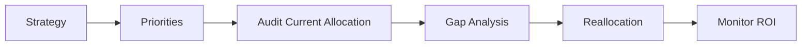

# Resource Allocation Protocol

The primary job of an executive is deciding where *not* to spend resources.

## Architecture

### 1. Priorities (The "One Metric")
What is the single most important metric for the company right now? (e.g., Revenue, User Growth, Retention).

### 2. Audit
Where are people actually spending their time? Does it align with the priority?
- *Example*: If Retention is #1, why do we have 80% of engineers on new features?

### 3. Reallocation
Move resources to the bottleneck. This is painful but necessary.
- **Kill Projects**: Stop work that doesn't move the needle.

## When to Use
- **Quarterly Planning**: Adjusting headcount.
- **Crisis**: Emergency shifting of focus.

## Operational Principles
1. **Focus on Constraints**: Investing anywhere other than the bottleneck is an illusion.
2. **Sunk Cost Fallacy**: Money spent is gone. Only look forward.
3. **People are not Widgets**: You can't just swap a Backend Dev for a Sales Rep instantly.
