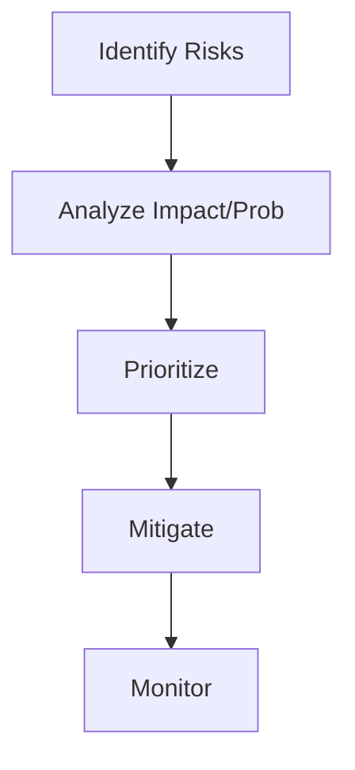

# Risk Assessment Protocol

Systematic evaluation of what could kill the company or project.

## Architecture

### 1. Identify Risks
Brainstorm "Pre-Mortem": Assume it's 2 years later and we failed. Why?
- **Market**: Competitor eats us.
- **Product**: No one wants it.
- **Financial**: Run out of cash.

### 2. Analyze (The Matrix)
Map each risk on a 2x2 grid: **Likelihood** vs **Impact**.
- **High Impact / High Likelihood**: Kill the project or solve immediately.
- **High Impact / Low Likelihood**: Insure against it.

### 3. Mitigate
- **Avoid**: Don't do the risky thing.
- **Reduce**: Take steps to lower likelihood.
- **Transfer**: Buy insurance / Outsource.
- **Accept**: Acknowledge it and move on.

## When to Use
- **Board Meetings**: Demonstrating governance.
- **Major Decisions**: Acquisitions, pivots.

## Operational Principles
1. **Paranoia is Good**: It's not pessimistic, it's protective.
2. **Unknown Unknowns**: Leave margin for error for things you can't predict.
3. **Transparency**: Hide nothing from the board/investors.
