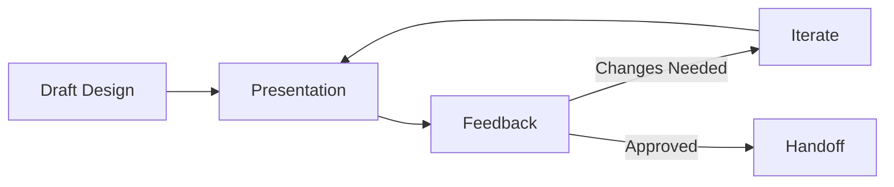

# Design Review Protocol

A structured forum for critiquing visual and interaction design before implementation.

## Architecture

### 1. Presentation
The designer walks through the flow, explaining the *rationale* behind decisions. Use a click-through prototype if possible.

### 2. Feedback (C.R.I.T.)
- **Constructive**: Help improve, don't just tear down.
- **Relevant**: Stick to the goals of the project.
- **Interrogative**: Ask "Why?" before saying "Change this."
- **Timely**: Give feedback while it's cheap to change.

### 3. Handoff
Prepare the Figma file for engineers (redlines, assets, empty states).

## When to Use
- **Mid-Process**: When the direction is set but details are flexible.
- **Pre-Handoff**: Final check.

## Operational Principles
1. **Problems, not Solutions**: Stakeholders should point out problems ("User won't see this"), not dictate solutions ("Make it blue").
2. **Consolidate**: Synthesize conflicting feedback during the meeting.
3. **Focus**: Don't bikeshed on minor details. Focus on the core user flow.
