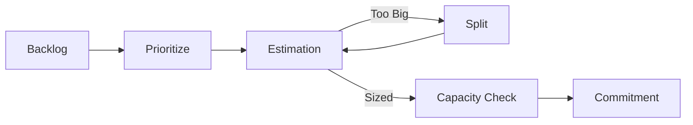

# Sprint Planning Protocols

Sprint Planning aligns the engineering team on *what* to build and *why* for the next 2 weeks.

## Architecture

### 1. Prioritization (Product)
The PM comes prepared with a ranked list of tickets based on business value and urgency.

### 2. Estimation (Eng)
The team assigns complexity points (Fibonacci: 1, 2, 3, 5, 8).
- **Goal**: Agree on *relative* effort, not exact hours.

### 3. Capacity Check
Compare total points against the team's historical velocity (minus holidays/PTO).

### 4. Commitment
The team agrees: "We believe we can deliver this set of work."

## When to Use
- **Start of Sprint**: Every 2 weeks (e.g., Monday morning).

## Operational Principles
1. **Definition of Ready**: Do not accept a ticket into the sprint unless it has a spec and design.
2. **Don't Overfill**: Leave 20% buffer for the unexpected.
3. **Team Decision**: The PM decides *what*, the Team decides *how much*.
