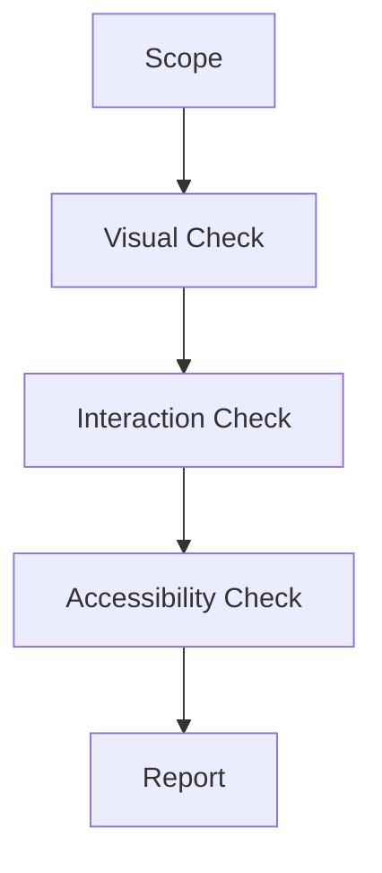

# UI Audit Protocol

A UI Audit ensures that the implemented product matches the design vision and industry standards.

## Architecture

### 1. Visual Consistency
- **Typography**: Are fonts/sizes consistent with the Design System?
- **Spacing**: Is padding/margin consistent (8pt grid)?
- **Color**: Are we using the defined palette?

### 2. Interaction Design
- **States**: Do buttons have hover, active, disabled states?
- **Feedback**: Does the user know their action succeeded or failed?
- **Responsiveness**: Does it break on mobile?

### 3. Accessibility (a11y)
- **Contrast**: Is text readable?
- **Keyboard Nav**: Can you use it without a mouse?
- **Screen Readers**: Do images have alt text?

## When to Use
- **Pre-Launch**: "Pixel Perfect" review.
- **Periodic Health Check**: Quarterly review of the entire app.

## Operational Principles
1. **Don't Trust Your Eyes**: Use tools (Inspect Element, Lighthouse).
2. **Mobile First**: If it works on mobile, it usually works on desktop.
3. **Errors are UX**: The text of an error message is part of the design.
